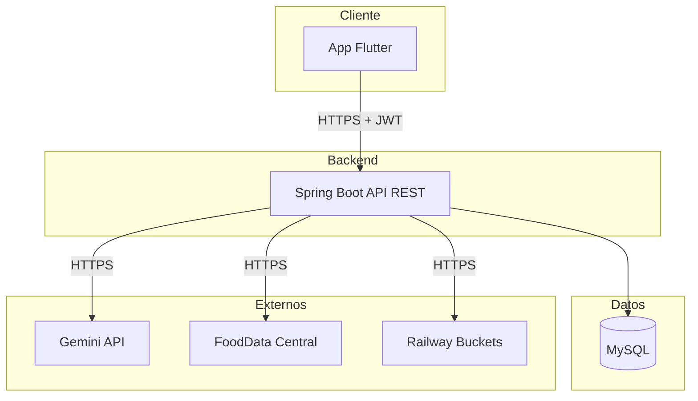

# 🥗 FoodLens

**Registro de comidas y estimación nutricional asistida por IA**

Fotografía tu plato. La IA identifica los alimentos y estima calorías y macronutrientes. Tú revisas, corriges si hace falta, y confirmas. Sin formularios largos, sin buscar cada alimento a mano.


---

## Índice

- [Problemática](#problemática)
- [Objetivos](#objetivos)
- [Tecnologías](#tecnologías)
- [Arquitectura](#arquitectura)
- [Estructura del repositorio](#estructura-del-repositorio)
- [Requisitos funcionales](#requisitos-funcionales)
- [Requisitos no funcionales](#requisitos-no-funcionales)
- [Historias de usuario](#historias-de-usuario)
- [Instalación y configuración](#instalación-y-configuración)
- [Cómo ejecutar el proyecto](#cómo-ejecutar-el-proyecto)

---

## Problemática

La mayoría de apps de registro nutricional fallan en retención porque buscar y pesar cada alimento manualmente es tedioso. El cuello de botella no es la falta de motivación: es la fricción de captura de datos. FoodLens reemplaza ese formulario por una foto en la mayoría de los casos, dejando la corrección manual como la excepción y no como el flujo principal.

Además, las fuentes de datos nutricionales estructurados (como FoodData Central) tienen cobertura pobre de platos peruanos compuestos (lomo saltado, arroz con pollo, cuy frito). Por eso los **alimentos personalizados** son una funcionalidad *Must have* del MVP y no un añadido opcional: la app necesita reconocer también la comida real del usuario, no solo alimentos genéricos.

## Objetivos

- Reducir el tiempo de registro de una comida al mínimo posible en el caso feliz (foto + confirmar).
- Mantener la corrección manual simple cuando la IA se equivoca, para que nunca sea más lenta que el registro manual tradicional.
- Mantener una arquitectura desacoplada del proveedor de IA y de la fuente nutricional, de modo que ambos puedan cambiarse sin rediseñar el sistema.

## Tecnologías

| Categoría | Tecnología |
|---|---|
| Backend | Java 25 (LTS), Spring Boot 4.1.1, Spring Data JPA, Spring Security, Maven |
| Base de datos | MySQL |
| Frontend móvil | Flutter + Dart, Riverpod, go_router, Dio |
| Inteligencia artificial | Google Gemini API (familia Flash) — análisis de imágenes de comida |
| Datos nutricionales | USDA FoodData Central API |
| Almacenamiento de imágenes | Railway Buckets (producción, S3-compatible) |
| Infraestructura | Railway (backend + MySQL + Bucket en producción) |
| Herramientas | IntelliJ IDEA, Android Studio, MySQL Workbench, Postman, Google Stitch (diseño UI) |
| Testing | JUnit 5, Mockito, Testcontainers, flutter_test, mocktail |
| CI/CD | GitHub Actions + despliegue automático de Railway |

## Arquitectura



## Estructura del repositorio

```
foodlens/
├── foodlens-backend/            # API REST (Spring Boot + Java 25)
│   ├── src/main/java/com/foodlens/backend/
│   │   ├── auth/
│   │   ├── users/
│   │   ├── foods/                # + integración con FoodData Central
│   │   ├── meals/                # + integración con Gemini
│   │   ├── water/
│   │   ├── storage/               # ImageStorageService (S3-compatible)
│   │   └── common/                # seguridad, excepciones, config
│   └── src/main/resources/db/migration/   # scripts Flyway versionados
└── foodlens_app/                 # App móvil (Flutter + Dart)
    └── lib/
        ├── core/                  # theme, router, cliente HTTP, storage
        └── features/              # auth, onboarding, meal_analysis, history, stats...
   
 
```

## Requisitos funcionales

<details>
<summary><strong>Ver los 36 requisitos funcionales, agrupados por módulo</strong></summary>

| ID | Módulo | Descripción |
|---|---|---|
| RF-01 | Autenticación y perfil | Registro con email y contraseña |
| RF-02 | Autenticación y perfil | Validación de formato de email y fortaleza mínima de contraseña |
| RF-03 | Autenticación y perfil | Login con email/contraseña; devuelve JWT de acceso + refresh token |
| RF-04 | Autenticación y perfil | Logout que revoca el refresh token |
| RF-05 | Autenticación y perfil | Recuperación de contraseña vía email con token de un solo uso y expiración |
| RF-06 | Autenticación y perfil | Edición de perfil (nombre, edad, sexo, peso, altura, nivel de actividad, objetivo) |
| RF-07 | Autenticación y perfil | Onboarding que solicita los datos mínimos de perfil para sugerir un objetivo calórico |
| RF-08 | Autenticación y perfil | Cálculo de objetivo calórico sugerido (Mifflin-St Jeor), sobrescribible manualmente |
| RF-09 | Análisis por foto | Capturar o seleccionar una foto de una comida |
| RF-10 | Análisis por foto | Comprimir la imagen antes de subirla |
| RF-11 | Análisis por foto | Enviar la imagen al backend para análisis |
| RF-12 | Análisis por foto | El backend invoca el servicio de IA y recibe alimentos candidatos (nombre, cantidad, unidad, confianza) |
| RF-13 | Análisis por foto | El backend resuelve cada alimento candidato contra la base nutricional |
| RF-14 | Análisis por foto | Si un alimento no resuelve, se ofrece crearlo como alimento personalizado |
| RF-15 | Análisis por foto | Cálculo de calorías y macronutrientes por alimento y por comida completa |
| RF-16 | Análisis por foto | Los resultados indican explícitamente que son una estimación |
| RF-17 | Corrección manual | Editar cantidad, unidad y alimento de cada ítem detectado |
| RF-18 | Corrección manual | Eliminar un ítem detectado |
| RF-19 | Corrección manual | Agregar manualmente alimentos adicionales al resultado |
| RF-20 | Corrección manual | Confirmar el análisis para guardar la comida |
| RF-21 | Corrección manual | Cancelar el análisis sin guardar nada |
| RF-22 | Registro manual | Registrar una comida sin foto, buscando alimentos por nombre |
| RF-23 | Registro manual | Especificar tipo de comida, fecha y hora |
| RF-24 | Alimentos personalizados | Crear un alimento personalizado (nombre + valores nutricionales) |
| RF-25 | Alimentos personalizados | Los alimentos personalizados son privados del usuario que los crea |
| RF-26 | Alimentos personalizados | Reutilizar un alimento personalizado en comidas futuras |
| RF-27 | Historial | Listar comidas registradas por día |
| RF-28 | Historial | Ver el detalle de una comida (alimentos, cantidades, nutrientes, foto) |
| RF-29 | Historial | Editar o eliminar una comida ya registrada |
| RF-30 | Dashboard y estadísticas | Mostrar calorías consumidas del día vs. objetivo |
| RF-31 | Dashboard y estadísticas | Mostrar macronutrientes consumidos del día vs. objetivo |
| RF-32 | Dashboard y estadísticas | Accesos rápidos a "analizar comida" y "registrar manualmente" |
| RF-33 | Dashboard y estadísticas | Mostrar promedio de calorías y macros de los últimos 7 días |
| RF-34 | Dashboard y estadísticas | Mostrar cumplimiento del objetivo calórico diario en un rango de fechas |
| RF-35 | Agua | Definir un objetivo diario de agua y registrar consumo incremental |
| RF-36 | Cuenta | Eliminar la cuenta y todos los datos asociados |

</details>

## Requisitos no funcionales

<details>
<summary><strong>Ver los 12 requisitos no funcionales</strong></summary>

| ID | Categoría | Requisito |
|---|---|---|
| RNF-01 | Seguridad | Comunicación HTTPS/TLS en todos los endpoints |
| RNF-02 | Seguridad | Contraseñas con hash (BCrypt); nunca en texto plano |
| RNF-03 | Seguridad | JWT firmado; access token de vida corta, refresh token revocable |
| RNF-04 | Privacidad | Fotos accesibles solo vía URL firmada/temporal; nunca públicas por defecto |
| RNF-05 | Rendimiento | Operaciones CRUD normales responden en <500 ms p95 (orientativo); IA muestra progreso |
| RNF-06 | Disponibilidad | Si el servicio de IA falla, el registro manual sigue funcionando |
| RNF-07 | Escalabilidad | Backend stateless (JWT, sin sesión en servidor) |
| RNF-08 | Usabilidad | El flujo foto → confirmación no supera 4 pantallas/pasos |
| RNF-09 | Mantenibilidad | Separación por capas (controller/service/repository/DTO); tests en cálculo nutricional |
| RNF-10 | Portabilidad | Backend y BD desplegables vía Docker Compose o Railway |
| RNF-11 | Internacionalización | Unidades métricas; sin soporte multi-idioma en el MVP (solo español) |
| RNF-12 | Compatibilidad | Android como plataforma del MVP; Flutter sin dependencias que bloqueen iOS a futuro |

</details>

## Historias de usuario

Formato **Como / Quiero / Para**, con criterios de aceptación.

| ID | Título | Prioridad | Requisitos relacionados |
|---|---|---|---|
| HU-01 | Registro de cuenta | Must have | RF-01, RF-02 |
| HU-02 | Inicio de sesión | Must have | RF-03 |
| HU-03 | Cierre de sesión | Must have | RF-04 |
| HU-04 | Recuperación de contraseña | Must have | RF-05 |
| HU-05 | Configuración inicial de perfil (onboarding) | Must have | RF-07, RN-02 |
| HU-06 | Objetivo calórico sugerido automáticamente | Must have | RF-08, RN-06 |
| HU-07 | Edición de perfil | Should have | RF-06 |
| HU-08 | Captura o selección de foto de comida | Must have | RF-09, RF-10 |
| HU-09 | Análisis automático de la foto por IA | Must have | RF-11, RF-12, RF-15, RF-16 |
| HU-10 | Resolución de alimentos contra la base nutricional | Must have | RF-13 |
| HU-11 | Crear alimento personalizado desde un ítem no reconocido | Must have | RF-14 |
| HU-12 | Ver el nivel de confianza de cada ítem detectado | Must have | RN-03 |
| HU-13 | Editar cantidad, unidad o alimento de un ítem | Must have | RF-17 |
| HU-14 | Eliminar un ítem detectado | Must have | RF-18 |
| HU-15 | Agregar manualmente un alimento no detectado | Must have | RF-19 |
| HU-16 | Confirmar el análisis | Must have | RF-20 |
| HU-17 | Cancelar el análisis | Must have | RF-21 |
| HU-18 | Registrar una comida sin foto | Must have | RF-22, RF-23 |
| HU-19 | Crear alimento personalizado desde "Mis alimentos" | Should have | RF-24, RF-25 |
| HU-20 | Reutilizar mis alimentos personalizados | Should have | RF-26 |
| HU-21 | Consultar historial de comidas por día | Must have | RF-27 |
| HU-22 | Ver el detalle de una comida registrada | Must have | RF-28 |
| HU-23 | Editar o eliminar una comida registrada | Must have | RF-29 |
| HU-24 | Ver el resumen diario de calorías y macros | Must have | RF-30, RF-31 |
| HU-25 | Acceder rápidamente a registrar una comida | Must have | RF-32 |
| HU-26 | Consultar promedios semanales | Should have | RF-33 |
| HU-27 | Consultar cumplimiento del objetivo en un rango | Should have | RF-34 |
| HU-28 | Registrar consumo de agua | Should have | RF-35 |
| HU-29 | Eliminar cuenta y todos los datos | Must have | RF-36, RN-07 |

## Instalación y configuración

### Prerrequisitos

- JDK 25
- Flutter SDK (canal estable) + Android Studio
- Cuenta y API key de [FoodData Central](https://api.data.gov/signup/) (gratuita)
- Cuenta y API key de [Google AI Studio](https://aistudio.google.com/) (Gemini)

## Cómo ejecutar el proyecto

**Backend:**
```bash
cd foodlens-backend
./mvnw spring-boot:run
# API disponible en http://localhost:8080
# Swagger UI en http://localhost:8080/swagger-ui.html
```

**Frontend:**
```bash
cd foodlens_app
flutter pub get
flutter run --dart-define=API_BASE_URL=http://10.0.2.2:8080
```
